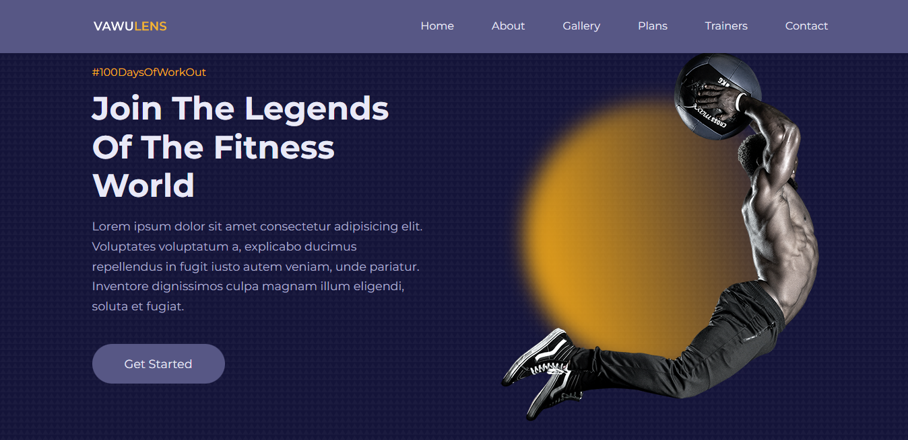
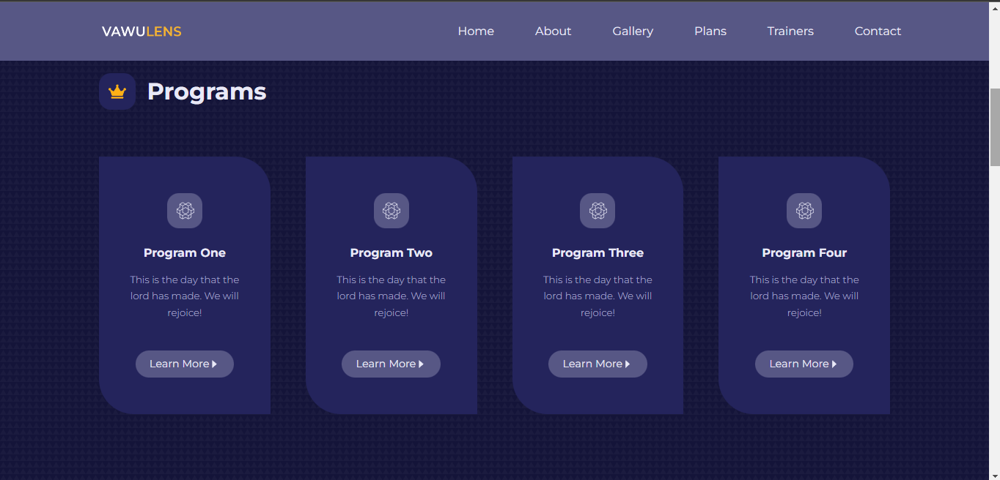
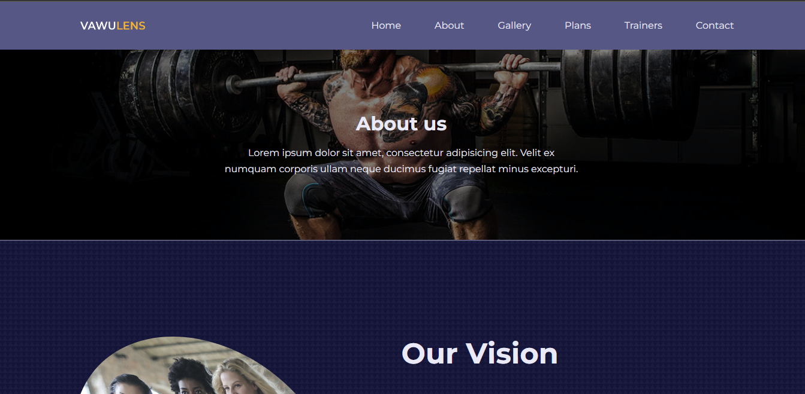
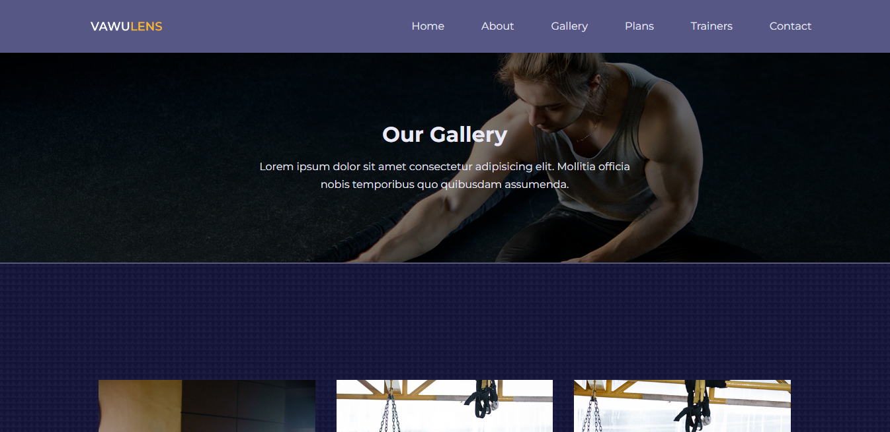
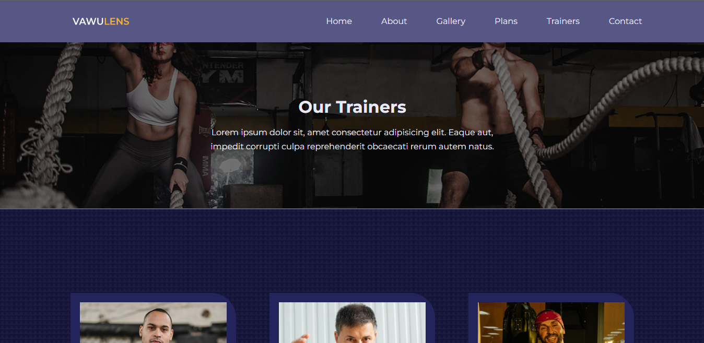
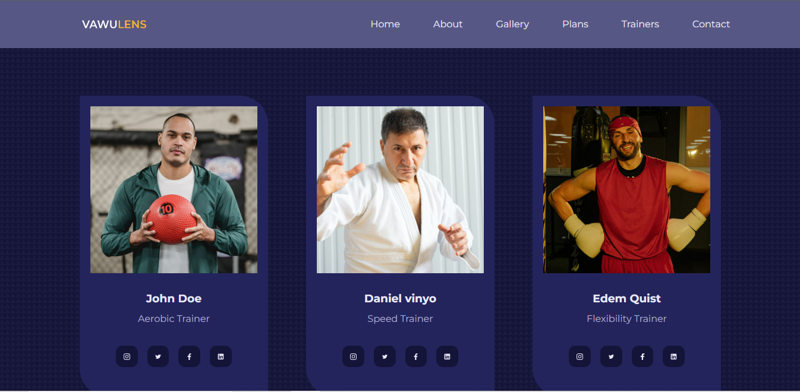
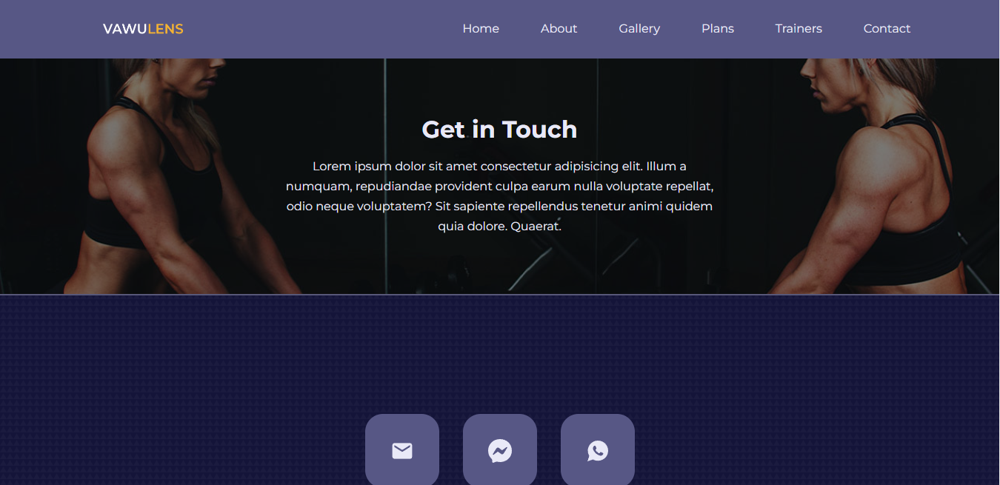

# react_gym

Projeto realizado em React com sistema de rotas utilizando a biblioteca padrão, react-router-dom.

 ##
  

  
  
  
  
  
  
  
  

  

### Instalação
`npm install`

### Para rodar o projeto
`npm run start`

### [Clique aqui para ver o projeto]()